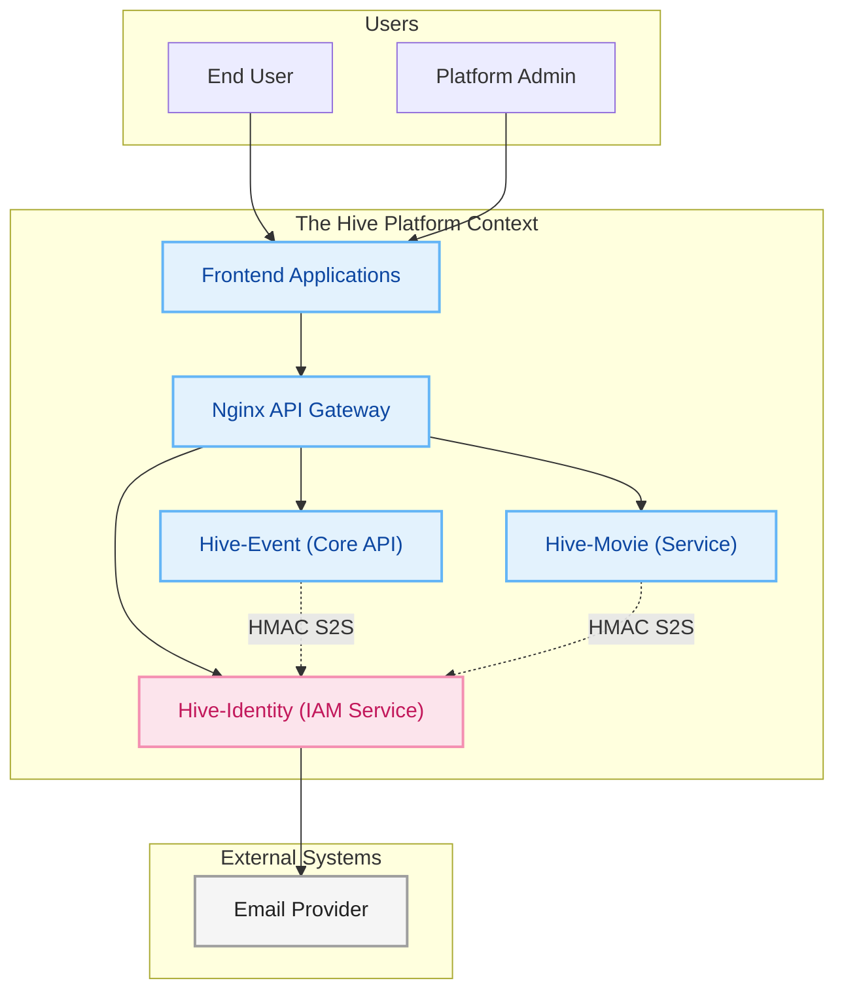
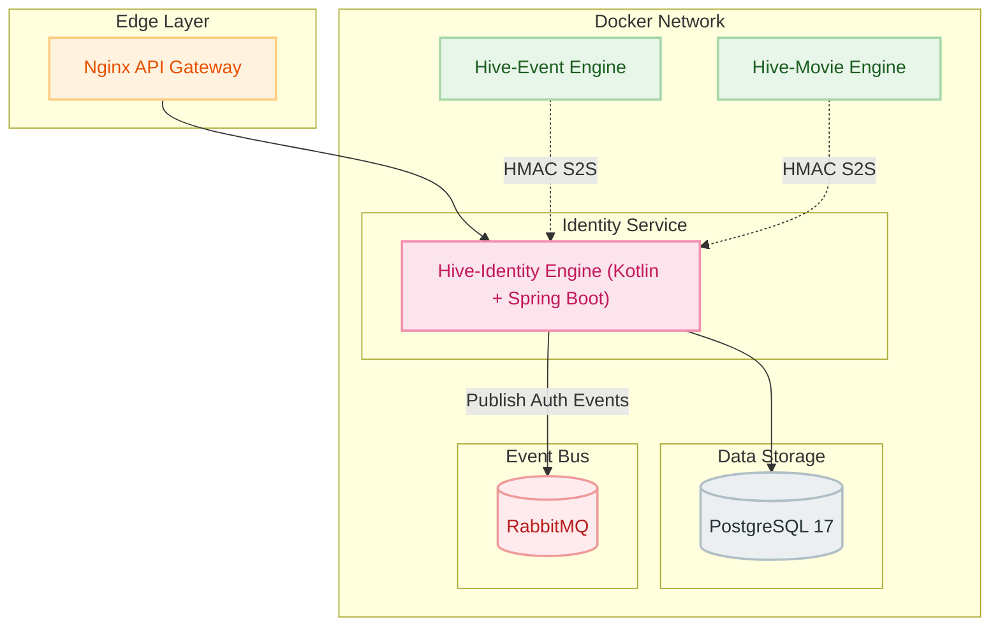
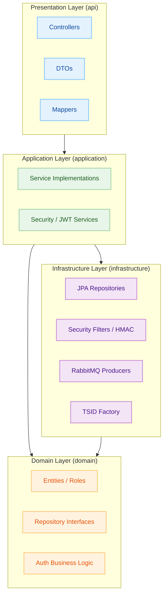
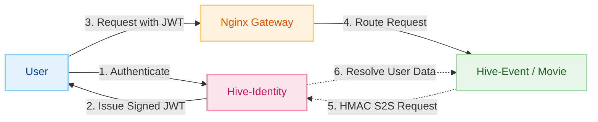
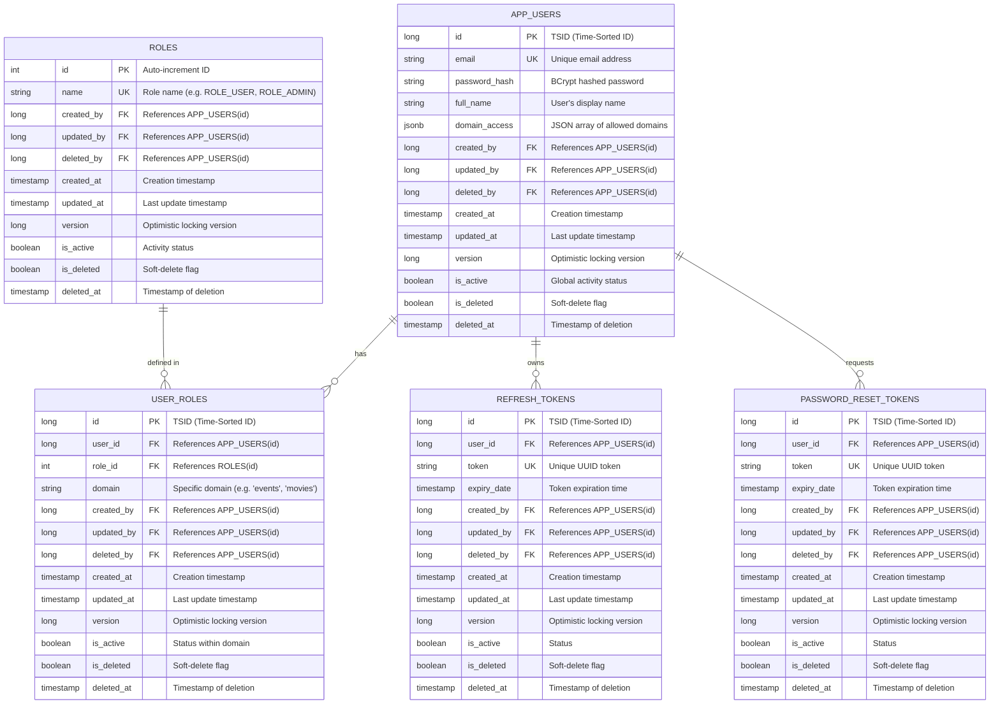

<p align="center">

</p>

<h1 align="center">Hive-Identity (Auth & User Service)</h1>

<p align="center"><em>The strict gatekeeper and central identity provider for the EventHive ecosystem, managing multi-tenant RBAC and secure user lifecycles.</em></p>

<p align="center">


</p>

---

> **Hive-Identity** is the foundational security layer of the Hive platform. Built with **Kotlin** and **Spring Boot 3
**, it
> provides a centralized, stateless authentication mechanism using JWTs, implements a robust multi-tenant RBAC model,
> and facilitates secure service-to-service (S2S) communication across the microservice cluster.

---

### 🔗 Associated Repositories

* 👉 **[The-Hive-Project (Main Hub)](https://github.com/Naveen2070/The-Hive-Project)**
* 👉 **[Hive-Event (Core API)](https://github.com/Naveen2070/The-Hive-Project/tree/main/services/core-api)**
* 👉 **[Hive-Forager-UI (Frontend)](https://github.com/Naveen2070/Hive-Forager-UI)**

---

## 🚀 Key Features

* **🛡️ Multi-Tenant RBAC:** Implements a sophisticated domain-based permission model. Users are assigned roles within
  specific domains (e.g., `events:ROLE_ORGANIZER`, `movies:ROLE_USER`), allowing for fine-grained access control across
  different platform segments.
* **🔑 Secure JWT Lifecycle:**
  * **Stateless Auth:** Issues signed JWTs containing a comprehensive `permissions` map and domain access list.
  * **Refresh Tokens:** Database-backed refresh token rotation for secure, long-lived sessions.
  * **Blacklisting:** Immediate token invalidation upon logout using an optimized in-memory blacklist.
* **🤝 Zero-Trust S2S Auth:** Protects internal data-fetching endpoints (`/api/internal/**`) with **HMAC-SHA256
  signatures**. Requires time-sensitive hashes generated with a shared secret to prevent replay attacks and unauthorized
  internal access.
* **🆔 High-Performance IDs:** Utilizes **TSIDs (Time-Sorted Identifiers)** for all primary keys, ensuring global
  uniqueness, URL safety, and optimal database indexing performance.
* **🐇 Async Notification Engine:** Decouples user interactions from notification delivery. Password reset events and
  welcome triggers are published to **RabbitMQ**, ensuring low-latency API responses.
* **👤 Complete User Lifecycle:** Centralized logic for registration, multi-factor profile updates, secure password
  hashing (BCrypt), and automated account status management.
* **👑 Administrative Control:** Powerful admin suite for global user search, manual role provisioning, and account
  auditing/moderation.

---

## 🛠️ Tech Stack

* **Language:** Kotlin (JDK 21)
* **Framework:** Spring Boot 3.4.3
* **Security:** Spring Security, JWT (jjwt 0.12.6), HMAC-SHA256
* **Database:** PostgreSQL 17
* **ORM:** Spring Data JPA (Hibernate)
* **Migration:** Liquibase
* **Messaging:** RabbitMQ (AMQP)
* **ID Generation:** TSID (Hypersistence Utils)
* **API Documentation:** OpenAPI 3 / Swagger (SpringDoc 2.8.5)
* **Build Tool:** Gradle (Kotlin DSL)

---

## 🏗️ Architecture

The project follows a **Feature-Based (Package-by-Feature)** architecture to maximize modularity and maintain clear
domain boundaries. Below are the structural diagrams of the Hive-Identity engine.

### High-Level Ecosystem



### Container Architecture



### Layered Architecture



### Zero-Trust Security Model



### Entity Relationship Diagram (ERD)



---

## 📂 Project Structure

The project follows a **Feature-Based (Package-by-Feature)** architecture to maximize modularity and maintain clear
domain boundaries:

```text
src/main/kotlin/com/thehiveproject/identity_service
├── auth                # Authentication feature (Login, Register, JWT, Refresh Tokens)
│   ├── controller      # Auth REST endpoints
│   ├── dto             # Auth-specific DTOs
│   ├── security        # JWT Filters, UserDetails, S2S Filters
│   └── service         # Auth business logic & token management
├── user                # User management feature (Profiles, Roles, Entities)
│   ├── controller      # User profile REST endpoints
│   ├── entity          # User, Role, UserRole JPA entities
│   ├── mapper          # Entity-to-DTO conversion logic
│   └── service         # User CRUD & Role management
├── admin               # Administrative feature (Global user & role management)
├── internal            # Internal-only endpoints for service-to-service calls
├── common              # Shared logic (TSID Factory, Base Entities, Exceptions)
├── config              # Spring beans, Security, Audit, and RabbitMQ config
└── notification        # RabbitMQ producers for async events
```

---

## ⚙️ Getting Started (How to Run)

### Prerequisites

* **Java 21** (for manual runs)
* **Docker & Docker Compose**
* **RabbitMQ**
* **PostgreSQL**

### 1. Clone the Repository

```bash
git clone https://github.com/Naveen2070/The-Hive-Project.git
cd The-Hive-Project/services/identity-service
```

### 2. Environment Variables (`.env`)

```ini
# Database
DB_USERNAME=admin
DB_PASSWORD=SuperSecretPassword123!

# JWT Security
JWT_SECRET=your_super_secret_jwt_key_here
JWT_EXPIRATION_MS=3600000

# Zero-Trust S2S Config
INTERNAL_SHARED_SECRET=your_s2s_shared_key
```

### 3. Run via Docker Compose

```bash
docker-compose up --build -d
```

---

## 🔌 API Endpoints

### 🔐 Authentication

| Method | Endpoint                    | Description                           | Access |
|--------|-----------------------------|---------------------------------------|--------|
| `POST` | `/api/auth/register`        | Register a new user                   | Public |
| `POST` | `/api/auth/login`           | Login and receive JWTs                | Public |
| `POST` | `/api/auth/refresh`         | Rotate access token via refresh token | Public |
| `POST` | `/api/auth/logout`          | Invalidate tokens                     | Auth   |
| `POST` | `/api/auth/forgot-password` | Initiate password reset (Email)       | Public |
| `POST` | `/api/auth/reset-password`  | Complete password reset               | Public |

### 👤 User Profile

| Method   | Endpoint                     | Description                | Access |
|----------|------------------------------|----------------------------|--------|
| `GET`    | `/api/users/me`              | Fetch current user profile | Auth   |
| `PATCH`  | `/api/users/me`              | Update profile (Full Name) | Auth   |
| `POST`   | `/api/users/change-password` | Securely change password   | Auth   |
| `DELETE` | `/api/users/deactivate/me`   | Self-deactivation          | Auth   |

### 👑 Administration

| Method   | Endpoint                       | Description                            | Access        |
|----------|--------------------------------|----------------------------------------|---------------|
| `GET`    | `/api/admin/users`             | Paginated user search                  | `SUPER_ADMIN` |
| `GET`    | `/api/admin/users/{id}`        | Get full user record by ID             | `SUPER_ADMIN` |
| `POST`   | `/api/admin/users`             | Create internal user with manual roles | `SUPER_ADMIN` |
| `PATCH`  | `/api/admin/users/{id}/status` | Toggle user active status (Ban/Unban)  | `SUPER_ADMIN` |
| `DELETE` | `/api/admin/users/{id}/hard`   | Permanent record removal               | `SUPER_ADMIN` |

### 🤖 Internal (S2S)

| Method | Endpoint                    | Description                               | Access   |
|--------|-----------------------------|-------------------------------------------|----------|
| `GET`  | `/api/internal/users/{id}`  | Resolve user summary (for data hydration) | Internal |
| `POST` | `/api/internal/users/batch` | Batch resolve user summaries              | Internal |

---

<p align="center">
Built with ❤️, ☕, and secure distributed systems.🛡️<br>
<b>Architected and maintained by <a href="https://github.com/Naveen2070">Naveen</a></b>
</p>
